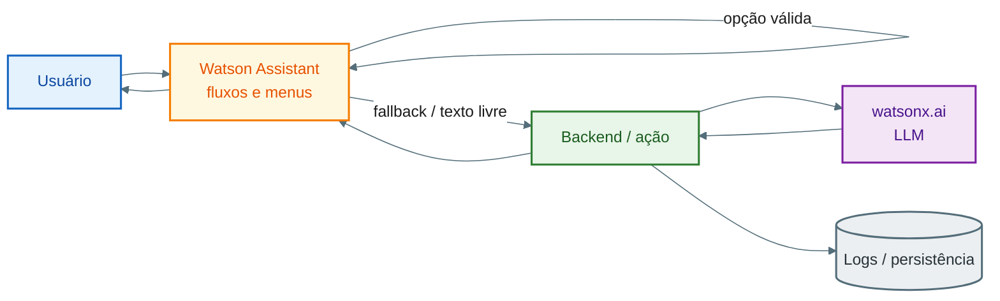

# Pesquisa — Chatbot híbrido no ecossistema IBM Watson

**Título:** Pesquisa e definição de arquitetura para chatbot híbrido (fluxo determinístico + fallback conversacional com LLM)

---

**Proposta de arquitetura (diagrama + search em Action + CTAs):** ver **`docs/proposta-arquitetura-hibrida-poc.md`**.

**Plano de ação em etapas (Assistant, SDK, consolidação):** ver **`docs/plano-de-acao-poc-hibrida.md`**.

---

## Contexto

Hoje o chatbot corporativo é construído no **Watson Assistant**, com **árvore de decisão** e fluxos por menus: o usuário **caminha** até obter o serviço. Não há **conversa aberta** com modelo generativo; o comportamento é essencialmente **determinístico**.

A necessidade de negócio é **evoluir para um modelo híbrido**: manter **menus e fluxos** onde forem obrigatórios (compliance, transações, roteiros fixos) e, quando o usuário **não escolher uma opção válida** ou fizer **pergunta livre**, acionar um **fallback conversacional** baseado em **LLM**, com governança e rastreabilidade.

---

## Base técnica da pesquisa (MVP interno)

O repositório **WATSON_AI** (PoC) demonstra o **padrão conceitual** desejado: um **roteador** que prioriza um caminho **determinístico** (por exemplo, cálculo em Python) e **cai para LLM** (watsonx.ai via SDK) quando não há regra fechada.

Esse MVP serve como **referência de comportamento** (roteamento, prompts, validação leve, persistência de atendimento), **não** como substituto do Watson Assistant em produção.

---

## Objetivo da pesquisa

Mapear **como** implementar o híbrido **dentro do ecossistema Watson**, **sem misturar produtos**: separar claramente:

| Produto | Papel |
|--------|--------|
| **Watson Assistant** | Orquestração de diálogo, árvores, menus, slots, ações |
| **watsonx.ai** | Modelos fundacionais / geração de texto sob demanda |
| Outros (ex.: RAG, vector store) | Somente quando documentados e com escopo próprio |

Evitar tratar “Watson” como um único produto genérico.

---

## Escopo da pesquisa

- Padrões de **roteamento**: menu válido → fluxo no Assistant; entrada fora do menu, baixa confiança ou intenção “livre” → **ação** que chama serviço com **LLM**.
- **Pontos de integração** do Assistant com **APIs** (webhooks, extensões, ações) e **contratos** de dados (contexto, sessão, ramo do menu, histórico resumido).
- Uso de **watsonx.ai** como **motor de geração** sob demanda (não como substituto do motor de fluxo).
- **Governança**: limites de tema; opcionalmente **RAG** com documentos aprovados; **logs** de atendimento e auditoria.
- **Custo, latência e UX**: quando chamar LLM; como **retornar ao menu**; como sinalizar ao usuário modo “fluxo oficial” vs “resposta assistida por IA”.
- **Watson Orchestrate**: posicionar apenas se surgir necessidade de **orquestração ampla** (agentes, ferramentas); registrar se o MVP corporativo pode começar só com **Assistant + watsonx**.

---

## Entregáveis esperados

- Documento de **arquitetura alvo** (referência) com diagrama de integração.
- Lista de **decisões** (o que permanece no fluxo, o que vai para LLM, o que exige confirmação humana).
- **Riscos e mitigações** (alucinação, dados sensíveis, compliance).
- **Próximos passos** para prova de conceito no ambiente corporativo (implementação fora do escopo desta pesquisa).

---

## Critérios de sucesso

- A equipe consegue **explicar em uma página** o papel de cada produto Watson no híbrido.
- Existe um **desenho de integração** aceito como base para experimentação.
- Critérios claros de **quando** o Assistant mantém o fluxo e **quando** o LLM entra.

---

## Desenho de integração (referência)

### Fluxo lógico

1. O **usuário** envia mensagem no canal (web, WhatsApp, etc.).
2. O **Watson Assistant** classifica a entrada e **percorre o diálogo** (menus, slots, validações).
3. Se a entrada **corresponde** a uma opção válida do fluxo atual → **continua no Assistant** (determinístico).
4. Se **não corresponde** (ou confiança baixa / intenção de pergunta livre) → **nó de fallback** no Assistant chama uma **ação** (backend).
5. O **backend** monta o **prompt** com contexto (ramo do menu, políticas, resumo do histórico) e chama **watsonx.ai** (`generate`).
6. A resposta volta ao Assistant e é **enviada ao usuário**; opcionalmente o fluxo oferece **“voltar ao menu”** ou **continuar em modo livre**.
7. **Persistência** (MongoDB, logging corporativo, etc.) registra sessão, fonte da resposta (`fluxo` vs `llm`) e metadados para auditoria.

### Diagrama

Versão com **cores** e **fundo branco** (adequada para exportar PNG). Quebras de linha no rótulo usam ` `.

**Legenda (cores):** azul — usuário; âmbar — Watson Assistant; verde — backend/ação; roxo — watsonx.ai; cinza — persistência.

> **Nota:** Visualização: GitHub/GitLab, VS Code (Mermaid), [Mermaid Live Editor](https://mermaid.live) (exportar PNG com fundo branco). Se o `%%init%%` não for suportado pelo seu gerador, use só o bloco `flowchart` + `classDef` — as cores dos nós permanecem.

---

## Relação com o MVP WATSON_AI

| Conceito no MVP | Analogia no alvo corporativo |
|-----------------|------------------------------|
| Roteador (`response_router`) | Nós + intenções no Assistant + ação de fallback |
| Cálculo determinístico (Python) | Fluxos, APIs e regras no Assistant / backend |
| `ask_watson` / watsonx.ai | Chamada a modelo fundacional em watsonx.ai |
| Persistência Mongo (`chat_sessions` / `chat_messages`) | Padrão de auditoria equivalente no ambiente da empresa |

---

*Documento gerado para apoio à contabilização de horas de pesquisa e alinhamento de arquitetura.*
