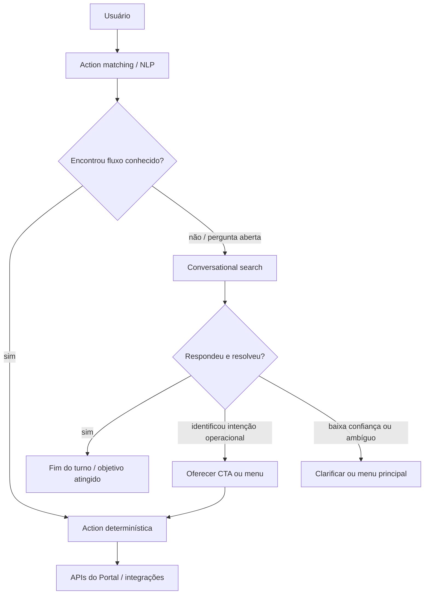

# Proposta de arquitetura — híbrido transacional + busca conversacional (PoC / estudos)

**Status:** proposta para **orientar** o aprendizado na PoC e o desenho futuro no **Watson Assistant** + ecossistema IBM. Não substitui decisão formal de arquitetura do produto.

**Relacionado:** `docs/pesquisa-chatbot-hibrido-watson.md`, `docs/watson-assistant-orchestrate-hibrido.md`.

**Plano de ação (etapas):** `docs/plano-de-acao-poc-hibrida.md`.

---

## 1. Visão geral

O objetivo é combinar:

- **Fluxos determinísticos** (Actions, integrações com APIs do Portal) onde o negócio exige passos claros e auditáveis.
- **Respostas a perguntas abertas** (conversational search / conteúdo curado + LLM quando aplicável), sem abandonar o usuário em “texto solto”.

Princípio de UX acordado como **requisito de arquitetura** (não opcional):

> Depois de uma resposta aberta/informativa, o assistente deve **sempre que possível** oferecer **próximo passo operacional** (CTA, menu ou Action conhecida) — transformar dúvida em ação.

---

## 2. Fluxo lógico (primeiro nível)

Leitura em texto:

1. Entrada do **usuário**.
2. **Action matching / NLP**: houve correspondência com um fluxo **já modelado** (intent + entidades + regras do Assistant)?
   - **Sim** → seguir **Action determinística** até chamadas às **APIs do Portal** (ou equivalente).
   - **Não**, ou mensagem é **pergunta aberta** → entrar em **conversational search** (ou ramo informativo com acervo + geração, conforme produto).
3. Dentro do **conversational search**:
   - Se a resposta **resolve** a dúvida e não há necessidade de operação → **fim** (ou micro-confirmação).
   - Se o sistema **identifica** intenção operacional (ex.: “quero emitir boleto”) → **oferecer CTA** e **redirecionar** para Action determinística.
   - Se **baixa confiança** ou **ambiguidade** → **clarificar** ou retornar ao **menu principal** / escolha explícita.

---

## 3. Variante recomendada: search **dentro** de uma Action

Para muitos cenários de atendimento, esta forma costuma ser **mais madura** que um “search global” isolado:

1. O usuário faz uma pergunta aberta (ex.: sobre boleto, cobrança, prazo).
2. O **roteamento** coloca o usuário numa **Action** de contexto (ex.: “Ajuda sobre pagamentos”).
3. Um **step** dessa Action usa **conversational search** (ou conteúdo curado + geração) para **explicar**.
4. O **step seguinte** oferece continuidade explícita, por exemplo:
   - “Quer emitir o boleto agora?”
   - “Quer listar seus contratos?”
   - “Quer voltar ao menu?”

A IBM documenta que é possível adicionar **search como step** em Actions novas ou existentes; isso **alinha** o desenho ao produto e mantém **contexto** e **saída** para fluxo transacional.

---

## 4. Regras práticas por tipo de necessidade

| Tipo | Tratamento sugerido |
|------|---------------------|
| **Fluxos críticos** (autenticação, listar contratos, escolher contrato/parcela, gerar boleto, etc.) | **Sempre** determinísticos via Actions + APIs; sem depender só de LLM. |
| **Perguntas abertas** (“como funciona a segunda via?”, “o que acontece se atrasar?”, “não entendi essa cobrança”) | **Conversational search** / acervo institucional (+ LLM quando a política permitir). |
| **Após resposta aberta** | **Sempre** que fizer sentido: oferecer **handoff** para Actions conhecidas (emitir boleto, consultar contratos, menu de pagamentos). |

Anti-padrão a evitar na experiência final:

- Resposta livre → **fim** sem ponte para o que o usuário pode fazer a seguir.

Padrão desejado:

- Resposta informativa → **sugestão de próximo passo operacional** (CTA / menu / Action).

---

## 5. Relação com a PoC `WATSON_AI` (Python)

O repositório atual **simula** apenas uma fatia desse desenho:

- **Determinístico:** `calculadora.py` (parcela).
- **Aberto + RAG + LLM:** `response_router` → `watson_client` + corpus.

Ele **não** substitui o **Watson Assistant**; serve para aprender **roteamento**, **prompts**, **RAG** e **parâmetros de geração**. O encaixe com **Actions reais** e **conversational search** no Assistant será o **próximo passo** na UI IBM + SDK.

---

## 6. Próximos passos sugeridos (aprendizado)

1. Criar no **watsonx Assistant** um **fluxo pequeno** com Actions (UI).
2. Opcional: uma Action com **step de search** + steps de **CTA** conforme esta proposta.
3. Conectar a instância à PoC (ou script) via **SDK** (`message` / sessão), mantendo o ramo Python/watsonx.ai como laboratório paralelo até unificação de desenho.

---

## 7. Changelog

| Data | Nota |
|------|------|
| (PoC) | Primeira versão consolidada a partir do diagrama e recomendações de UX/IBM alinhadas ao estudo do time. |
